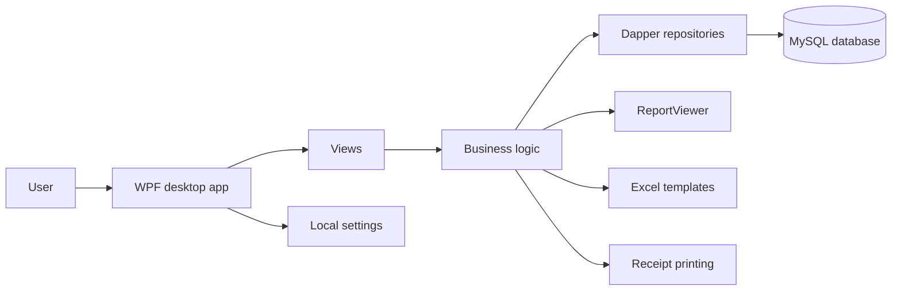
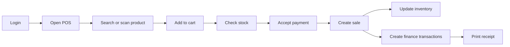

# SaleDot POS

[](LICENSE)


Дипломный проект 2022 года: настольная система автоматизации небольшой точки продаж.

Приложение помогает вести товары, клиентов, поставщиков, сотрудников, продажи, закупки, складские остатки, кассовые операции и базовую финансовую отчетность. Проект реализован как Windows desktop-приложение на WPF с MySQL-хранилищем и репозиториями на Dapper.

## Основные возможности

- Авторизация пользователей и работа с ролями `superadmin`, `admin`, `user`, `customer`, `vendor`.
- Главная панель со сводкой по продажам, клиентам, поставщикам и персоналу.
- Справочник товаров с ценами, скидками, штрих-кодами, остатками и статусами активности.
- POS-окно для оформления продаж, поиска товаров и работы в режиме штрих-кодов.
- Оформление продаж и закупок с детализацией операций.
- Учет клиентов, поставщиков, администраторов и сотрудников.
- Финансовый блок: счета, балансы, транзакции, расходы и закрытие кассы.
- Журнал складских изменений и отчет по стоимости товарных остатков.
- Настройки подключения к MySQL и параметры печати чеков.
- Просмотр отчетов через ReportViewer.
- Работа с Excel-шаблонами через Microsoft Office Interop.
- Встроенное окно для выполнения SQL-запросов в административном режиме.

## Ключевой сценарий работы

1. Администратор настраивает подключение к MySQL и запускает приложение.
2. Пользователь входит в систему под своей ролью.
3. Администратор добавляет товары, поставщиков, клиентов и сотрудников.
4. Кассир открывает POS-окно и добавляет товары в корзину вручную или по штрих-коду.
5. Система проверяет остатки товара и рассчитывает итоговую сумму продажи.
6. После завершения продажи создаются финансовые операции и обновляются складские остатки.
7. Администратор просматривает продажи, закупки, балансы, расходы и кассовые закрытия.
8. При необходимости формируются отчеты и печатные документы.

## Архитектура

Приложение построено как классический WPF desktop-проект с разделением на окна интерфейса, бизнес-логику, модели представления и слой доступа к данным.

Основные зоны ответственности:

- `Views` - WPF-окна приложения: dashboard, POS, продажи, закупки, товары, пользователи, настройки и отчеты.
- `Views/finance` - кассовый и финансовый блок: продажи, покупки, транзакции, счета, балансы, расходы.
- `Views/product` - управление товарами, складскими остатками и товарными отчетами.
- `Views/user` - управление клиентами, поставщиками и персоналом.
- `Views/others` - настройки БД, настройки приложения, SQL-запросы, SMS и служебные диалоги.
- `data/dapper` - Dapper-модели и репозитории для работы с MySQL.
- `data/viewmodel` - модели данных для экранов продаж, закупок и API-ответов.
- `bll` - бизнес-логика: продажи, закупки, финансы, инвентарь, печать, настройки и сетевые утилиты.
- `assets` - шаблоны и графические ресурсы.

Внешние зависимости подключены через NuGet и локальные DLL Telerik UI for WPF. Проект ориентирован на запуск в Windows-среде через Visual Studio.

## Mermaid-схемы

Компонентная архитектура:



Основной сценарий продажи:



## Технологический стек

| Область | Технологии |
| --- | --- |
| Desktop UI | WPF, XAML, MaterialDesignThemes, Telerik UI for WPF |
| Language / Runtime | C#, .NET Framework 4.8 |
| Data access | Dapper, Dapper.Contrib, Entity Framework 6 |
| Database | MySQL |
| Reports | Microsoft ReportViewer |
| Documents | Microsoft Office Interop Excel, Excel templates |
| Configuration | App.config, user settings, local database settings |
| Build | Visual Studio 2022, MSBuild, x86 configuration |

## Desktop-особенности / Технические акценты

- WPF-приложение собрано как `WinExe` под `.NET Framework 4.8`.
- Основная конфигурация сборки использует платформу `x86` из-за desktop-зависимостей и COM-ссылок.
- Доступ к MySQL вынесен в Dapper-репозитории.
- Проверка подключения к БД выполняется при запуске приложения.
- Если сервер БД недоступен, открывается окно настройки подключения.
- POS-окно поддерживает режим работы со штрих-кодом и ручной поиск товаров.
- При добавлении товара в корзину выполняется проверка доступного остатка.
- Финансовые операции создаются на основе продаж, закупок, расходов и кассовых действий.
- Печать чеков и параметры страницы вынесены в настройки приложения.
- ReportViewer используется для просмотра отчетов внутри desktop-интерфейса.
- Excel Interop используется для операций с документами и шаблонами.

## Интеграции и внешние зависимости

| Интеграция | Как используется | Локальный режим |
| --- | --- | --- |
| MySQL | Основное хранилище товаров, пользователей, продаж, финансовых операций и настроек | Требуется локальный или удаленный MySQL Server |
| Telerik UI for WPF | Расширенные WPF-компоненты интерфейса | DLL лежат в локальном каталоге `SaleDot/lib` |
| ReportViewer | Отображение отчетов | Подключается через NuGet-пакеты Microsoft ReportViewer |
| Microsoft Office Interop Excel | Работа с Excel-шаблонами и документами | Требует установленного Microsoft Office для соответствующих сценариев |
| Локальные настройки | Параметры БД, печати и поведения POS | Хранятся в user settings и локальном `databaseconnection.json` |

## Локальный запуск

Требования:

- Windows.
- Visual Studio 2022 или новее.
- Workload `.NET desktop development`.
- .NET Framework 4.8 Developer Pack.
- MySQL Server.
- NuGet package restore.
- Microsoft Office для сценариев, связанных с Excel Interop.

Клонирование:

```bash
git clone https://github.com/steel-snake-sx/saledot-pos.git
cd saledot-pos
```

Открыть solution:

```text
SaleDot/SaleDot.sln
```

В Visual Studio выберите конфигурацию `Debug|x86` или `Release|x86`, восстановите NuGet-пакеты и выполните сборку.

Команда для проверки через MSBuild:

```powershell
MSBuild.exe SaleDot/SaleDot.sln /p:Configuration=Debug /p:Platform=x86 /restore
```

Тестовый вход администратора:

```text
Login: superadmin
Password: sa@bb
```

Эти данные предназначены только для локального учебного запуска.

## Конфигурация

Основные параметры задаются через настройки приложения и окно `DatabaseSettingWindow`.

| Настройка | Назначение |
| --- | --- |
| `DatabaseServer` | Адрес MySQL-сервера |
| `DatabaseName` | Имя базы данных |
| `DatabaseUsername` | Пользователь MySQL |
| `DatabasePassword` | Пароль пользователя MySQL |
| `PrinterPageWidth` | Ширина страницы чека |
| `PrinterMarginLeft` | Левый отступ печати |
| `NumberOfReceiptToPrint` | Количество печатаемых чеков |
| `BarcodeMode` | Режим работы POS-окна со штрих-кодом |
| `Title` | Название торговой точки в настройках приложения |
| `Footer` | Текст нижней части чека |

Значения подключения по умолчанию:

```text
Server: localhost
Database: saledot
User: root
Password: 1234
```

Локальный файл `SaleDot/SaleDot/data/databaseconnection.json` содержит параметры подключения конкретной машины и исключен из Git через `.gitignore`.

## База данных

Приложение рассчитано на MySQL. При запуске оно проверяет подключение к серверу и наличие базы данных.

В коде предусмотрено создание базы из файла:

```text
SaleDot/SaleDot/data/saledot.sql
```

В текущем архивном состоянии репозитория этот SQL-файл отсутствует. Для полноценного запуска может потребоваться восстановить SQL-дамп дипломного проекта или вручную создать схему по моделям и репозиториям из каталога `SaleDot/SaleDot/data`.

## Структура каталогов

```text
SaleDot/
├── SaleDot.sln
├── lib/
│   └── RCWPF/
└── SaleDot/
    ├── SaleDot.POS.csproj
    ├── App.xaml
    ├── Login.xaml
    ├── bll/
    ├── data/
    │   ├── dapper/
    │   └── viewmodel/
    ├── Views/
    │   ├── finance/
    │   ├── product/
    │   ├── user/
    │   ├── others/
    │   └── report/
    └── assets/
```

`bin`, `obj`, `.vs`, `MigrationBackup` и старые `SaleDot_Backup_*` исключены из Git. В репозитории оставлены исходники актуального проекта и необходимые ресурсы.

## Проверка качества

Команды для локальной проверки:

```powershell
MSBuild.exe SaleDot/SaleDot.sln /p:Configuration=Debug /p:Platform=x86 /restore
```

Ручной smoke-test:

- Запустить приложение из Visual Studio.
- Проверить подключение к MySQL или открыть окно настройки БД.
- Войти под тестовым `superadmin`.
- Открыть главную панель.
- Открыть справочник товаров.
- Открыть POS-окно.
- Добавить товар в корзину и проверить расчет суммы.
- Открыть список продаж или финансовых транзакций.
- Проверить настройки печати и параметры приложения.

## Статус проекта

- Проект является архивным дипломным проектом 2022 года.
- Основная цель проекта: показать реализацию desktop POS-системы для небольшой торговой точки.
- Репозиторий очищен от закоммиченных build-артефактов, `.vs`, `bin`, `obj` и backup-каталогов.
- Для полноценного запуска может потребоваться восстановление SQL-дампа `saledot.sql`.
- Зависимости отражают состояние проекта на момент разработки и могут требовать обновления.
- Перед реальным использованием нужны ревизия безопасности, миграция секретов из локальных файлов, обновление пакетов и полноценное тестирование.

## Лицензия

MIT License. Подробнее см. `LICENSE`.
